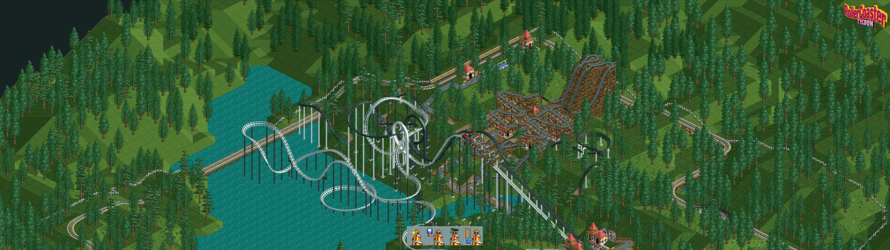
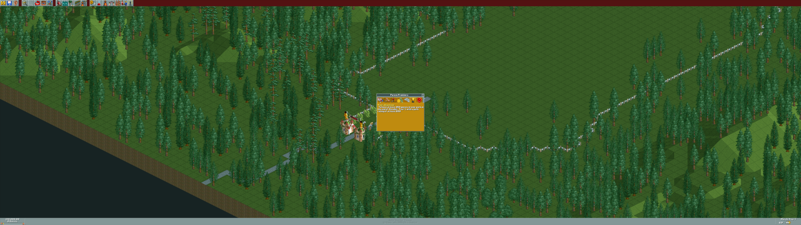

# RCT HiRes

Play the **original RollerCoaster Tycoon (1999)** on modern monitors — from 640 x 480 up to
7680 x 4320, full screen or in a window, with sharp pixel-perfect scaling.

**[Download the latest release](../../releases/latest)** — `RCT-HiRes-Setup.exe`

## Works with

| Version | Notes |
|---|---|
| **RollerCoaster Tycoon Deluxe from GOG.com** | Base game plus both expansion packs. No disc needed. |
| **RollerCoaster Tycoon: Deluxe from Steam** (English) | Base game plus both expansion packs. No disc needed. |
| **The original 1999 CD release** (base game) | Needs its CD, or a disc image (`.iso`) that RCT HiRes mounts for you. |

RCT HiRes checks the exact version of your game before it changes anything and politely refuses
versions it doesn't know yet (expansion-pack updates of the CD release, Classic, other languages).
More versions are planned.

## What you get

A small launcher opens before the game and lets you choose:

- **Game** — which copy to play, if you have more than one
- **Display** — full screen or a resizable window
- **Resolution** — any mode your monitor supports, up to 7680 x 4320: 4K, ultrawide, super-ultrawide, 8K
- **Game size** — 1x to 4x. At 2x every pixel is doubled, so the game is twice as big and still sharp
- **Refresh rate** — any rate your monitor supports (full screen)
- **Keys** — optionally scroll the map with W A S D instead of the arrow keys

Your choices are remembered.

The original game is hard-wired for 1280 x 1024 at most. Raising that limit alone leaves missing strips
of picture or crashes on bigger screens, because two internal "what needs redrawing" tables are sized
for 1280 x 1024. RCT HiRes enlarges them, so the game runs cleanly at 4K, super-ultrawide and 8K.

## Install

1. Download `RCT-HiRes-Setup.exe` from the [latest release](../../releases/latest) and run it.
2. Start the game from the new **RollerCoaster Tycoon (HiRes)** shortcut.
3. If your copy isn't listed under **Game**, click **Add...** and choose its `rct.exe`.

- **No administrator rights needed.**
- **Your game folder is never changed.** RCT HiRes makes a patched copy of the game program from your
  own installation and keeps it in `%LOCALAPPDATA%\Programs\RCT HiRes`. Your saved parks stay where
  they are, and the normal game keeps working.
- **Uninstall** any time from Windows Settings > Apps.
- The installer isn't code-signed, so Windows SmartScreen may say *"Windows protected your PC"*.
  Click **More info** > **Run anyway**.

**Requirements:** Windows 10 or 11, and your own installed copy of a supported version.

**Updating:** just run the new installer over the old one; your settings are kept.

## Known limitations

- The CD release still needs its CD or a disc image to start new scenarios. RCT HiRes doesn't bypass
  the game's disc check.
- The closest in-game zoom is the game's native pixel size. Use **Game size** to make everything bigger.
- Steam's Play button starts the normal game. Use the **RollerCoaster Tycoon (HiRes)** shortcut for
  RCT HiRes.
- With W A S D scrolling on, the arrow keys no longer scroll and the W, A, S and D shortcuts
  (e.g. S = Staff, D = Research) are off.

## Credits

[cnc-ddraw](https://github.com/FunkyFr3sh/cnc-ddraw) by FunkyFr3sh (MIT) does the DirectDraw emulation
and scaling. [jeFF0Falltrades' rct_full_res](https://github.com/jeFF0Falltrades/Tutorials/tree/master/rct_full_res)
and the [RCTgo custom resolution tutorial](https://forums.rctgo.com/thread-19271.html) mapped the game's
resolution code first.

## Legal

RollerCoaster Tycoon is a trademark of its respective owners. RCT HiRes is an unofficial fan project, not
affiliated with or endorsed by them. It contains no game files — you need your own copy of the game —
and it doesn't remove or bypass the game's copy protection.
